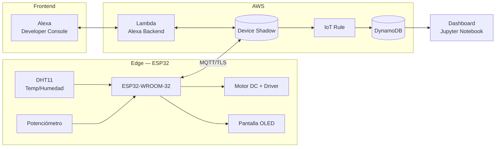

# Ventilador Inteligente — Reporte Técnico

> **Sistema IoT con AWS y Alexa**
> Carrera: Ingeniería de Sistemas · Asignatura: SIS-234

Prototipo de un **ventilador inteligente** basado en un microcontrolador **ESP32** integrado a **AWS IoT Core** mediante **Device Shadows**, controlado por voz a través de **Amazon Alexa**, con almacenamiento de datos en **DynamoDB** y visualización en un **dashboard** elaborado con Jupyter Notebook.

---

## Tabla de contenido

- [1. Descripción del proyecto](#1-descripción-del-proyecto)
- [2. Requerimientos](#2-requerimientos)
  - [2.1 Requerimientos funcionales](#21-requerimientos-funcionales)
  - [2.2 Requerimientos no funcionales](#22-requerimientos-no-funcionales)
- [3. Arquitectura del sistema](#3-arquitectura-del-sistema)
- [4. Objeto inteligente (Hardware)](#4-objeto-inteligente-hardware)
  - [4.1 Componentes](#41-componentes)
  - [4.2 Diagrama del circuito](#42-diagrama-del-circuito)
  - [4.3 Conexiones (pinout)](#43-conexiones-pinout)
- [5. Firmware del ESP32](#5-firmware-del-esp32)
  - [5.1 Estructura del código](#51-estructura-del-código)
  - [5.2 Módulos](#52-módulos)
  - [5.3 Lógica de control](#53-lógica-de-control)
- [6. Integración con AWS IoT Core y Shadows](#6-integración-con-aws-iot-core-y-shadows)
  - [6.1 Estructura del Shadow](#61-estructura-del-shadow)
  - [6.2 Tópicos MQTT utilizados](#62-tópicos-mqtt-utilizados)
- [7. Alexa (Frontend y Backend)](#7-alexa-frontend-y-backend)
  - [7.1 Modelo de interacción (Intents)](#71-modelo-de-interacción-intents)
  - [7.2 Backend (AWS Lambda)](#72-backend-aws-lambda)
- [8. Procesamiento y almacenamiento en la nube](#8-procesamiento-y-almacenamiento-en-la-nube)
- [9. Reportes y dashboard](#9-reportes-y-dashboard)
- [10. Cómo ejecutar el proyecto](#10-cómo-ejecutar-el-proyecto)
- [11. Estructura del repositorio](#11-estructura-del-repositorio)
- [12. Trabajo futuro](#12-trabajo-futuro)

---

## 1. Descripción del proyecto

El **Ventilador Inteligente** es un sistema IoT que regula la velocidad de un motor DC en función de la temperatura del ambiente y de las órdenes del usuario. El objeto inteligente captura **temperatura** y **humedad** mediante un sensor DHT11, controla la velocidad de un **motor DC** y muestra el estado en una **pantalla OLED**.

El dispositivo reporta su estado a **AWS IoT Core** y recibe comandos a través de su **Device Shadow**. El usuario puede interactuar con el ventilador de dos formas:

1. **Localmente**, girando un **potenciómetro** para fijar la velocidad.
2. **Por voz**, mediante una **skill de Amazon Alexa** que consulta y modifica el Shadow.

Además, el sistema soporta un **modo automático** en el que el ventilador se enciende solo cuando la temperatura supera un umbral configurable.

> [!NOTE]
> Los datos reportados se almacenan en **DynamoDB** mediante una **AWS IoT Rule** y se visualizan en un **dashboard** generado con Python (Jupyter Notebook + Matplotlib).

---

## 2. Requerimientos

### 2.1 Requerimientos funcionales

| ID | Requerimiento | Estado |
| --- | --- | :---: |
| RF-01 | Conectarse a una red Wi-Fi para comunicarse con AWS. | Sí |
| RF-02 | Capturar temperatura y humedad del entorno con el sensor DHT11. | Sí |
| RF-03 | Controlar la velocidad del motor DC mediante señal PWM (0–100 %). | Sí |
| RF-04 | Permitir el control manual de la velocidad mediante un potenciómetro. | Sí |
| RF-05 | Reportar el estado (temperatura, humedad, velocidad, modo) a AWS IoT Core vía Shadow. | Sí |
| RF-06 | Recibir y aplicar comandos desde el Shadow (`desired`). | Sí |
| RF-07 | Soportar un **modo automático** que enciende el ventilador al superar un umbral de temperatura. | Sí |
| RF-08 | Mostrar el estado del sistema en una pantalla OLED. | Sí |
| RF-09 | Controlar el ventilador por voz mediante Alexa (consultas y comandos). | Sí |
| RF-10 | Almacenar el histórico de datos en una base de datos NoSQL (DynamoDB). | Sí |
| RF-11 | Presentar la información en un dashboard para la toma de decisiones. | Sí |

### 2.2 Requerimientos no funcionales

- [x] **Comunicación segura**: conexión MQTT sobre **TLS** (puerto `8883`) con certificados X.509.
- [x] **Reconexión automática** a AWS IoT Core si se pierde la conexión MQTT.
- [x] **Procesamiento en el Edge**: el control del motor y el modo automático se ejecutan en el propio ESP32.
- [x] **Eficiencia de red**: se publica el estado solo cuando hay cambios significativos o cada 10 minutos (*heartbeat*).
- [x] **Modularidad**: el firmware está separado en clases reutilizables (`Sensor`, `Motor`, `Display`, etc.).
- [x] **Arranque robusto**: el dispositivo sincroniza la hora vía NTP (necesaria para validar los certificados TLS).

---

## 3. Arquitectura del sistema



**Flujo de datos:**

1. El **ESP32** lee los sensores y publica su estado en `state.reported` del Shadow.
2. Alexa (o el usuario) escribe en `state.desired`; AWS genera un **delta** que el ESP32 aplica.
3. Cada actualización del Shadow dispara una **IoT Rule** que persiste los datos en **DynamoDB**.
4. Los datos exportados desde DynamoDB alimentan el **dashboard** en Jupyter.

---

## 4. Objeto inteligente (Hardware)

### 4.1 Componentes

| Componente | Modelo | Función |
| --- | --- | --- |
| Microcontrolador | **ESP32-WROOM-32** | Procesamiento, Wi-Fi y MQTT |
| Sensor | **DHT11** | Temperatura y humedad |
| Actuador | **Motor DC** + driver tipo **L298N** | Flujo de aire del ventilador |
| Entrada manual | **Potenciómetro 1 kΩ** | Ajuste local de velocidad |
| Pantalla | **OLED SSD1306 0.96" (I²C)** | Visualización del estado |
| Regulador | **LM1117-3.3** | Alimentación a 3.3 V |

### 4.2 Diagrama del circuito


### 4.3 Conexiones (pinout)

| Periférico | Señal | GPIO ESP32 |
| --- | --- | :---: |
| DHT11 | DATA | `GPIO 4` |
| Potenciómetro | Señal analógica | `GPIO 32` (ADC) |
| Motor (driver) | `IN1` (dirección) | `GPIO 18` |
| Motor (driver) | `ENA` (PWM velocidad) | `GPIO 5` |
| OLED SSD1306 | `SDA` | `GPIO 21` |
| OLED SSD1306 | `SCL` | `GPIO 22` |

> [!IMPORTANT]
> El motor se alimenta con **12 V** a través del driver; el ESP32 y los sensores trabajan a **3.3 V / 5 V**. La señal PWM se genera en el canal `0` a **5 kHz** con resolución de **8 bits**.

---

## 5. Firmware del ESP32

### 5.1 Estructura del código

El firmware está escrito en **C++ (Arduino framework)** y organizado en módulos con responsabilidad única:

```text
SourceCode/Src/
├── main.cpp            # Orquestación y lógica de control
├── WiFiManager.{h,cpp} # Conexión a la red Wi-Fi
├── Sensor.{h,cpp}      # Lectura del DHT11
├── Motor.{h,cpp}       # Control PWM del motor DC
├── Potentiometer.{h,cpp} # Lectura del potenciómetro
├── Display.{h,cpp}     # Manejo de la pantalla OLED
└── AWSShadow.{h,cpp}   # Comunicación MQTT con AWS IoT y Shadow
```

### 5.2 Módulos

<details>
<summary><b>WiFiManager</b> — Gestión de la conexión Wi-Fi</summary>

Encapsula la conexión a la red inalámbrica con un *timeout* configurable (10 s por defecto) y expone el estado de la conexión y la IP local.

```cpp
WiFiManager wifi(ssid, password);
if (!wifi.connect()) { /* manejo de fallo */ }
```
</details>

<details>
<summary><b>Sensor</b> — Lectura del DHT11</summary>

Devuelve temperatura (°C) y humedad (%). Si la lectura falla, retorna `NAN`, lo que permite ignorar valores inválidos antes de publicarlos.
</details>

<details>
<summary><b>Motor</b> — Control del motor DC</summary>

Mapea el porcentaje de velocidad (1–100 %) al rango PWM `77–255`. El valor mínimo de **77** (~30 %) garantiza que el motor tenga par suficiente para arrancar; con `0 %` el PWM es `0`.

```cpp
// Maps 1..100 → minPWM..255
speedPWM_ = map(targetPercent_, 1, 100, 77, 255);
```
</details>

<details>
<summary><b>Potentiometer</b> — Entrada manual</summary>

Lee el ADC con promediado de **8 muestras** para reducir ruido y lo normaliza a un porcentaje (0–100 %).
</details>

<details>
<summary><b>Display</b> — Pantalla OLED</summary>

Muestra temperatura, humedad, velocidad (con barra de progreso), el modo de operación (`AUTO`/`MANUAL`) y el umbral configurado.
</details>

<details>
<summary><b>AWSShadow</b> — Cliente MQTT y Shadow</summary>

Gestiona la conexión MQTT segura, la suscripción a los tópicos del Shadow, el parseo de los mensajes `delta` y la publicación del estado `reported`.
</details>

### 5.3 Lógica de control

El control se ejecuta **en el Edge** dentro del `loop()` principal:

**a) Modo manual (potenciómetro con *debounce*)**

El potenciómetro se divide en 5 rangos. Para evitar cambios erráticos, se aplica un *debounce* de **500 ms**: la velocidad solo se publica cuando el rango se mantiene estable.

| Rango (% del potenciómetro) | Velocidad publicada |
| :---: | :---: |
| `< 20 %` | 0 % |
| `20 – 40 %` | 25 % |
| `40 – 60 %` | 50 % |
| `60 – 80 %` | 75 % |
| `≥ 80 %` | 100 % |

**b) Modo automático (control por temperatura)**

```cpp
if (aws.getAutoMode()) {
    float temp = sensor.readTemperature();
    int threshold = aws.getTempThreshold();
    int desiredSpeed = (!isnan(temp) && temp >= threshold) ? 50 : 0;
    // ... publica solo si cambió y cada 2 s como máximo
}
```

> [!TIP]
> En **modo automático** el potenciómetro se ignora: el ventilador arranca al **50 %** cuando la temperatura iguala o supera el umbral, y se apaga cuando baja.

**c) Publicación inteligente del estado**

Para no saturar la red, el estado `reported` se publica solo cuando:

- La **temperatura** cambia ≥ 1 °C, **o**
- La **humedad** cambia ≥ 3 %, **o**
- Cambia la velocidad por orden del Shadow, **o**
- Han pasado **10 minutos** desde la última publicación (*heartbeat*).

---

## 6. Integración con AWS IoT Core y Shadows

La comunicación se realiza por **MQTT sobre TLS** (puerto `8883`) usando certificados X.509 (CA raíz, certificado del dispositivo y clave privada). El *thing* registrado es **`Esp32Ventilador`**.

### 6.1 Estructura del Shadow

```json
{
  "state": {
    "desired": {
      "speed": 50,
      "autoMode": true,
      "tempThreshold": 30
    },
    "reported": {
      "temperature": 26.2,
      "humidity": 22,
      "speed": 50,
      "autoMode": true,
      "tempThreshold": 30
    }
  }
}
```

| Campo | Tipo | Descripción |
| --- | --- | --- |
| `temperature` | `float` | Temperatura medida (°C) |
| `humidity` | `float` | Humedad relativa (%) |
| `speed` | `int` | Velocidad del motor (0–100 %) |
| `autoMode` | `bool` | Modo automático activado/desactivado |
| `tempThreshold` | `int` | Umbral de activación automática (°C) |

### 6.2 Tópicos MQTT utilizados

| Tópico | Operación | Uso |
| --- | --- | --- |
| `$aws/things/Esp32Ventilador/shadow/update` | Publish | Reportar estado y escribir `desired` |
| `$aws/things/Esp32Ventilador/shadow/update/delta` | Subscribe | Recibir cambios pendientes (`desired` ≠ `reported`) |
| `$aws/things/Esp32Ventilador/shadow/get` | Publish | Solicitar el documento completo al arrancar |
| `$aws/things/Esp32Ventilador/shadow/get/accepted` | Subscribe | Inicializar el estado al encender el dispositivo |

> [!NOTE]
> Al arrancar, el dispositivo solicita el documento completo del Shadow (`get`) para restaurar la última configuración (`autoMode`, `tempThreshold`, `speed`) sin perder el estado tras un reinicio.

---

## 7. Alexa (Frontend y Backend)

El frontend es la **pestaña Test de la Alexa Developer Console**. El backend es una función **AWS Lambda** (Python, `ask-sdk`) que traduce las intenciones de voz en consultas y modificaciones del Shadow.

### 7.1 Modelo de interacción (Intents)

| Intent | Ejemplo de frase | Acción |
| --- | --- | --- |
| `GetTemperatureIntent` | *"¿Cuál es la temperatura?"* | Lee `reported.temperature` |
| `GetHumidityIntent` | *"¿Qué humedad hay?"* | Lee `reported.humidity` |
| `GetSpeedLevelIntent` | *"¿A qué velocidad va?"* | Lee `reported.speed` |
| `GetAllValuesIntent` | *"Dame el estado completo"* | Lee todo el `reported` |
| `UpdateSpeedLevelIntent` | *"Pon la velocidad en 75"* | Escribe `desired.speed` |
| `SetAutoModeIntent` | *"Activa el modo automático"* | Escribe `desired.autoMode` |
| `GetAutoModeIntent` | *"¿Está el modo automático?"* | Lee `reported.autoMode` |
| `SetTempThresholdIntent` | *"Cambia el umbral a 28"* | Escribe `desired.tempThreshold` |
| `GetTempThresholdIntent` | *"¿Cuál es el umbral?"* | Lee `reported.tempThreshold` |

> [!WARNING]
> La velocidad se valida en el rango **0–100** y el umbral de temperatura en **0–60 °C**. Las peticiones fuera de rango se rechazan con un mensaje de voz al usuario.

### 7.2 Backend (AWS Lambda)

- Identifica al usuario mediante una tabla **DynamoDB `user_thing`** que asocia el `user_id` de Alexa con su `thing_name`.
- Lee el estado con `iot-data → get_thing_shadow`.
- Modifica el estado con `iot-data → update_thing_shadow` (escribiendo en `desired`).
- Incluye manejo de errores y un `CatchAllExceptionHandler` para respuestas robustas.

```python
def update_shadow_desired(thing_name, desired):
    client = get_iot_data_client()
    client.update_thing_shadow(
        thingName=thing_name,
        payload=json.dumps({"state": {"desired": desired}})
    )
```

---

## 8. Procesamiento y almacenamiento en la nube

Cada actualización del Shadow dispara una **AWS IoT Rule** que extrae los campos `reported` y los inserta en una tabla **DynamoDB**, generando un histórico para análisis.

**Esquema de los registros almacenados:**

| Columna | Descripción |
| --- | --- |
| `thing_name` | Identificador del dispositivo (`Esp32Ventilador`) |
| `timestamp` | Marca de tiempo en milisegundos (epoch) |
| `temperature` | Temperatura (°C) |
| `humidity` | Humedad (%) |
| `speed` | Velocidad del motor (%) |
| `autoMode` | Modo automático (`true`/`false`) |
| `tempThreshold` | Umbral configurado (°C) |

El conjunto de datos se exporta como CSV ([results (5).csv](../SourceCode/scriptDashboard/results%20(5).csv)) para alimentar el dashboard.

---

## 9. Reportes y dashboard

El dashboard se genera con **Python (Pandas + Matplotlib)** en el notebook [script.ipynb](../SourceCode/scriptDashboard/script.ipynb) e incluye:

- **Tarjetas KPI**: temperatura, humedad, velocidad, modo, umbral y tiempo de operación acumulado.
- **Temperatura vs. umbral** en el tiempo, con marcado de máximos y mínimos.
- **Humedad** en el tiempo, con línea de promedio.
- **Velocidad del ventilador** (gráfico escalonado).
- **Línea de tiempo de estado** (encendido/apagado).
- **Distribución del modo de control** (automático vs. manual).
- **Resumen diario**: temperatura promedio/máx/mín, humedad promedio, tiempo de uso y número de activaciones.

Estos reportes permiten **tomar decisiones** sobre el comportamiento térmico del ambiente y el uso real del ventilador.

> [!TIP]
> El notebook detecta automáticamente el archivo CSV, normaliza los tipos de datos y convierte el `timestamp` (epoch en ms) a fechas legibles antes de graficar.

---

## 10. Cómo ejecutar el proyecto

### Firmware (ESP32)

1. Instalar el **ESP32 Arduino Core** y las librerías: `PubSubClient`, `ArduinoJson`, `DHT sensor library`, `Adafruit SSD1306`, `Adafruit GFX`.
2. Configurar en [main.cpp](../SourceCode/Src/main.cpp) las credenciales Wi-Fi, el `endpoint` de AWS IoT y los certificados X.509.
3. Compilar y cargar el firmware en el ESP32.

### Backend de Alexa (Lambda)

1. Crear la función Lambda con el código de [lambda.py](../SourceCode/Lambda/lambda.py) y el runtime de Python con `ask-sdk-core`.
2. Asignar permisos IAM para `iot:GetThingShadow`, `iot:UpdateThingShadow` y acceso a DynamoDB.
3. Vincular la función como *endpoint* de la skill en la Alexa Developer Console.

### Dashboard

```bash
pip install pandas numpy matplotlib jupyter
jupyter notebook SourceCode/scriptDashboard/script.ipynb
```

---

## 11. Estructura del repositorio

```text
ventiladoraInteligente/
├── README.md
├── Report/
│   ├── ThecnicalReport.md          # Este documento
│   └── Anex/
│       └── Circuit Diagram.jpeg    # Diagrama del circuito
└── SourceCode/
    ├── Src/                        # Firmware del ESP32 (C++)
    ├── Lambda/
    │   └── lambda.py               # Backend de la skill de Alexa
    └── scriptDashboard/
        ├── script.ipynb            # Generación del dashboard
        └── results (5).csv         # Datos exportados de DynamoDB
```

---

## 12. Trabajo futuro

- [ ] Migrar la conexión Wi-Fi a un **portal cautivo** con la librería `WiFiManager` para parametrizar la red sin recompilar.
- [ ] Añadir niveles intermedios de velocidad en el modo automático (control proporcional según la temperatura).
- [ ] Migrar el dashboard a **Amazon QuickSight** para visualización en tiempo real.
- [ ] Gestionar los certificados y credenciales mediante **variables de entorno o AWS Secrets Manager** en lugar de incluirlos en el código.

---

> Proyecto desarrollado para la asignatura **SIS-234** — Ingeniería de Sistemas.
